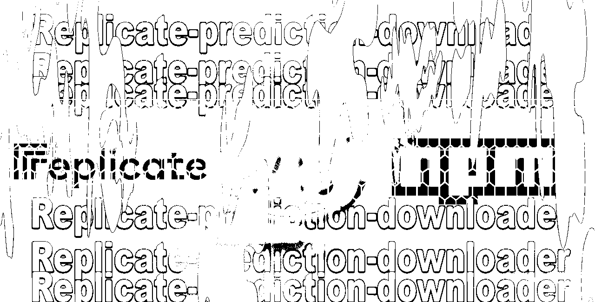

# Replicate Predictions Downloader 

A Node.js script to download and organize all your Replicate predictions, including images, metadata, and other outputs before they expire.



<div align="center">

[](https://badge.fury.io/js/replicate-predictions-downloader)
[](https://opensource.org/licenses/MIT)
[](https://nodejs.org/)
[](https://github.com/closestfriend/replicate-predictions-downloader/stargazers)

*A Node.js utility to preserve your Replicate AI predictions before they expire*

</div>

## Features

- Downloads all predictions from your Replicate account
- Organizes files by model and date
- Date filtering to avoid duplicate downloads
- Incremental downloads since last successful run
- Creates ZIP archives for each model (optional)
- Saves enhanced metadata for all predictions
- Shows detailed download statistics
- Preserves predictions before they expire

## Quick Start

```bash
npx replicate-predictions-downloader --last-run
```

You'll need your API token from [replicate.com/account/api-tokens](https://replicate.com/account/api-tokens) in the environment as `REPLICATE_API_TOKEN`.

## Why Use This Tool?

Replicate only stores your predictions temporarily. This tool helps you preserve your valuable work before it disappears, with intelligent organization to make your outputs easy to find later.

## Background

Replicate deletes predictions after 30 days. If you've been experimenting with models and want to keep your outputs - for portfolios, research, or just because you like them - you need to download them yourself. This tool does that, with some organization thrown in so you can actually find things later.

## Setup

### Prerequisites

- Node.js 18+ installed
- A Replicate account with API access

### Installation

#### Option 1: Clone and install locally

```bash
# Clone the repository
git clone https://github.com/closestfriend/replicate-predictions-downloader.git
cd replicate-predictions-downloader

# Install dependencies
npm install
```

#### Option 2: Install via npm

```bash
npm install -g replicate-predictions-downloader
```

### API Token Setup

Get your Replicate API token from: https://replicate.com/account/api-tokens

Set your API token using one of these methods:

1. Export in terminal (temporary):
   ```bash
   export REPLICATE_API_TOKEN=your_token_here
   ```

2. Create a .env file (permanent):
   ```
   REPLICATE_API_TOKEN=your_token_here
   ```

## Usage

### Basic Usage

Run the script:
```bash
# If installed locally
npm start

# Or directly
node index.js

# If installed globally
replicate-downloader
```

## What You'll See

When you run the tool, you'll see real-time progress as it fetches and downloads your predictions. The output includes details about what's being processed, download progress, and final statistics. Your files end up organized by model and date. There's also a metadata JSON if you're into that sort of thing.

### Date Filtering Options

Avoid duplicate downloads with intelligent date filtering:

```bash
# Download predictions since a specific date
node index.js --since "2024-01-15"

# Download predictions in a date range
node index.js --since "2024-01-01" --until "2024-01-31"

# Download only new predictions since last run (recommended for regular use)
node index.js --last-run

# Download predictions from the last 7 days
node index.js --since "7 days ago"

# Download all predictions (default behavior)
node index.js --all
```

### Date Format Examples

The tool accepts various date formats:
- ISO dates: `"2024-01-15"`, `"2024-01-15T10:30:00Z"`
- Relative dates: `"2 days ago"`, `"1 week ago"`, `"yesterday"`
- Natural language: `"January 15, 2024"`

### What the Script Does

1. **Fetches predictions** from Replicate (with optional date filtering)
2. **Downloads all outputs** for successful predictions
3. **Organizes files** by model and date
4. **Creates ZIP archives** for each model (if enabled)
5. **Saves detailed metadata** and tracks state for future runs

## Configuration

### Basic Settings

You can adjust these settings in the CONFIG object:
- `requestDelay`: Delay between API requests (ms)
- `downloadDelay`: Delay between downloads (ms)
- `maxPromptLength`: Maximum length for prompt in filenames
- `createZips`: Whether to create ZIP archives
- `enhancedMetadata`: Whether to save enhanced metadata

### State Tracking

The tool automatically creates a `.replicate-downloader-state.json` file to track:
- Last successful run timestamp
- Total predictions processed
- Successful predictions count

This enables the `--last-run` option for incremental downloads without duplicates.

## Output Structure

The tool creates a directory structure like this:

```
replicate_outputs_YYYY-MM-DD/
├── by-model/
│   ├── model1/
│   │   ├── YYYY-MM-DD_model1_prompt_id.png
│   │   ├── YYYY-MM-DD_model1_prompt_id.jpg
│   │   └── ...
│   ├── model2/
│   │   └── ...
│   └── ...
├── model1.zip
├── model2.zip
└── ...
replicate_metadata_YYYY-MM-DD.json
```

## Support

This is a tool I created for personal use. I'm sharing it in case others find it helpful, but I may not be able to provide extensive support. Pull requests are welcome!

## Command-Line Interface

The tool now includes a comprehensive CLI with help and version information:

```bash
# Show help
node index.js --help

# Show version
node index.js --version

# Available options
Options:
  -s, --since <date>     Download predictions created since this date
  -u, --until <date>     Download predictions created until this date
  -l, --last-run         Download only predictions since last successful run
  --all                  Download all predictions (default behavior)
  -h, --help             Display help for command
  -V, --version          Display version for command
```

## Contributing

Contributions are welcome! Please feel free to submit a Pull Request.

## Security Note

⚠️ Never commit your API token or .env file to version control!
The included .gitignore will help prevent this.

## License

This project is licensed under the MIT License - see the [LICENSE.md](LICENSE.md) file for details.


## Common Issues

**"Invalid API token" or "Authentication failed"**
- Double-check your token at [replicate.com/account/api-tokens](https://replicate.com/account/api-tokens)
- Make sure you've set `REPLICATE_API_TOKEN` in your environment or `.env` file
- Try: `echo $REPLICATE_API_TOKEN` to verify it's set

**"Network timeout" or connection errors**
- Check your internet connection
- The tool automatically retries failed downloads
- For persistent issues, try running with fewer concurrent requests by editing the CONFIG object

**"Permission denied" or file errors**
- Ensure you have write permissions in the current directory
- On Windows, try running as administrator if needed
- Make sure you have enough disk space for your downloads

**"No new predictions found"**
- If using `--last-run`, this means you're up to date!
- Try `--since "1 week ago"` to see recent predictions
- Use `--all` to redownload everything (may create duplicates)

**Files have weird names or special characters**
- The tool automatically sanitizes filenames
- Prompts longer than the limit (default: 50 chars) are truncated
- Adjust `maxPromptLength` in CONFIG if needed

**Need help?** Check existing [GitHub issues](https://github.com/closestfriend/replicate-predictions-downloader/issues) or create a new one.
